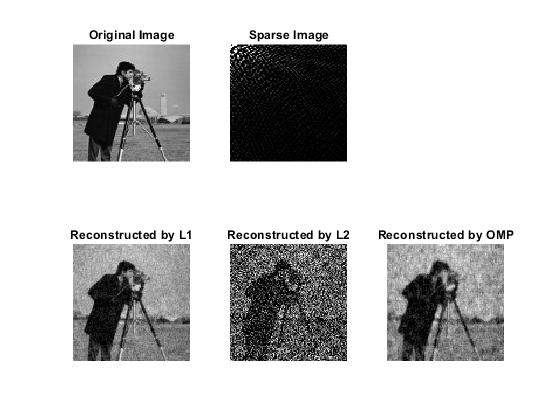

# Compressive-Sensing-Image-Reconstruction-Basic-Algorithm
This MATLAB code demonstrates the application of L1 optimization, L2 optimization, and Orthogonal Matching Pursuit (OMP) for the reconstruction of an image from its sparse representation, showcasing the effectiveness of sparsity-promoting algorithms in compressive sensing

# Compressive Sensing Reconstruction in MATLAB

This repository provides a MATLAB implementation of compressive sensing reconstruction algorithms, including \(\ell_1\) optimization (Basis Pursuit), \(\ell_2\) optimization, and Orthogonal Matching Pursuit (OMP). These algorithms are applied to reconstruct an image from its sparse representation, offering insights into the performance and characteristics of different reconstruction strategies in the context of compressive sensing.

## Installation

### Prerequisites
- MATLAB (R2018b or later recommended)
- CVX: A package for specifying and solving convex programs

### Installing CVX
1. Download CVX from the [official website](http://cvxr.com/cvx/download/).
2. Unzip the downloaded file to a directory of your choice.
3. Open MATLAB.
4. Navigate to the CVX directory you've just unzipped.
5. Run the `cvx_setup` script by typing `cvx_setup` in the MATLAB command window and pressing Enter. Follow any additional instructions that appear in the command window.

## Algorithms

- **L1 Optimization (Basis Pursuit)**: Seeks the sparsest solution by minimizing the \(\ell_1\) norm of the signal under the constraint that the reconstructed signal must be consistent with the observed measurements.
- **L2 Optimization**: Attempts to find a solution by minimizing the \(\ell_2\) norm (Euclidean norm) of the signal. While simpler, this approach does not inherently promote sparsity in the solution.
- **Orthogonal Matching Pursuit (OMP)**: A greedy algorithm that iteratively selects the dictionary elements most correlated with the current residual, updating the solution and residual at each step.

## Steps

1. **Read the Input Image**: Load and display the original image.
2. **Sparse Representation**: Compute the Discrete Cosine Transform (DCT) of the image to get its sparse representation.
3. **Sampling**: Generate a random Gaussian sampling matrix and use it to sample the sparse vector.
4. **Reconstruction**: Apply the \(\ell_1\) optimization, \(\ell_2\) optimization, and OMP algorithms to reconstruct the image from its sampled sparse representation.
5. **Inverse DCT**: Apply the inverse DCT to the reconstructed sparse vectors to obtain the final images.
6. **Display and Error Calculation**: Display the original, sparse, and reconstructed images, and calculate the reconstruction error for each algorithm.

## Why Does L2 optimization Perform Poorly?

The L2 optimization approach minimizes the Euclidean norm of the signal, which does not inherently promote sparsity in the solution. In compressive sensing, the key to successful reconstruction is exploiting the sparsity of the signal. The L1 norm minimization is known to be more effective in promoting sparsity, leading to better reconstruction of sparse signals from a limited number of measurements. Consequently, L2 optimization tends to perform poorly in scenarios where sparsity is crucial for accurate signal recovery, as it may result in solutions that are not sparse and hence not accurate reconstructions of the original sparse signal.

Result:

   

To-Do List (maybe if I have time) 
- [ ] Iterative Hard Thresholding (IHT)
- [ ] Compressive Sampling Matching Pursuit (CoSaMP)
- [ ] Subspace Pursuit (SP)
- [ ] Approximate Message Passing (AMP)
    <!--
- [ ] Fast Iterative Shrinkage-Thresholding Algorithm (FISTA)
- [ ] Total Variation Minimization
- [ ] Adaptive Outlier Pursuit
- [ ] Bayesian Compressive Sensing -->
